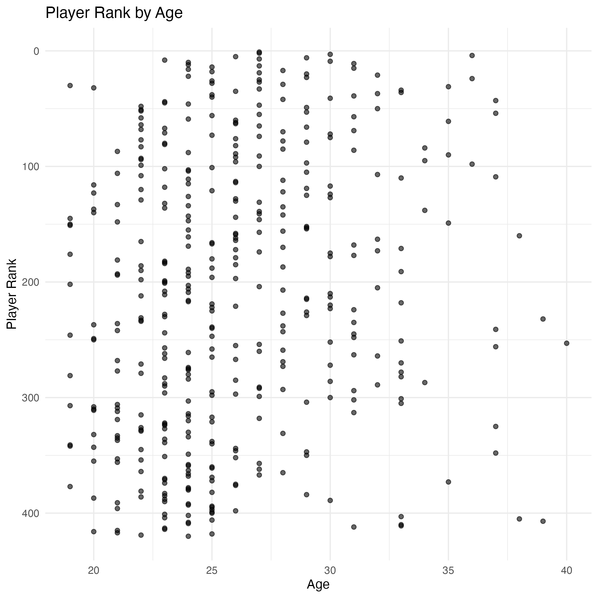

# Introduction 
In today’s NBA, performance analysis goes far deeper than traditional box scores. Teams, analysts, and even fans rely on data to understand how players contribute on both ends of the court and how teams function as units. This project takes a broad, accessible approach to that idea by compiling key statistics on NBA players and teams, evaluating efficiency, and visualizing how performance varies across different groups.

Using core metrics such as points, rebounds, assists, steals, and blocks, we developed impact rankings and efficiency scores to highlight standout players and competitive teams. We also created scatterplots examining trends by age—such as how scoring and rank shift over a player’s career—to reveal patterns that aren’t immediately obvious from raw numbers.

Beyond the analytics themselves, the value of this project lies in demonstrating how data can be organized and translated into insights. By cleaning the dataset, calculating composite metrics, and producing clear visualizations, we show the practical steps behind a typical sports analytics workflow. This makes the project useful not only for understanding NBA performance but also for illustrating how data-driven decision-making works in real-world settings.

```{r setup, include=FALSE}
knitr::opts_chunk$set(echo = TRUE)
library(dplyr)
library(ggplot2)
library(config)
library(knitr)

here::i_am("midterm_report.Rmd")

cfg <- config::get(
  file = here::here("config.yml"),
  config = params$env
)

age_type <- cfg$analysis$age_type
```

# Tabular Analysis
To evaluate how efficiently each team converts its scoring opportunities, we calculated a team-level shooting efficiency metric using total made field goals (FG) and total field-goal attempts (FGA). After grouping the data by team, we summed all FG and FGA values and computed a success ratio (FG ÷ FGA) to reflect overall shooting effectiveness. Teams were then ranked using this ratio, with higher values indicating stronger offensive efficiency. The resulting team_eff_small dataset contains each team’s efficiency ratio and corresponding rank, providing a simplified view of which teams consistently translate attempts into points.

```{r, team-efficiency, echo =FALSE}
team_eff_small <-
  readRDS(
    here::here("output", "team_eff_small.rds"))

knitr::kable(team_eff_small)
```

Then, To highlight the players who make the most of their scoring opportunities, we ranked the top 20 athletes based on their shooting efficiency. This metric reflects how effectively players convert their attempts into points, offering a clearer picture of scoring quality rather than just scoring volume. The chart below showcases the league’s most efficient shooters—those who don’t just take shots, but consistently make the right ones.
```{r, player-efficiency, echo =FALSE}
player_eff <-
  readRDS(
    here::here("output", "player_eff.rds")
  )


knitr::include_graphics(here::here("output", "top_players_eff.png"))
```

Based on these analyses, we created an impact rank to identify the top 20 players across all teams by integrating five key performance variables generated in our code pipeline: points scored (PTS), total rebounds collected (TRB), assists directly leading to successful scoring plays (AST), defensive steals (STL), and blocked shot attempts (BLK). These metrics were extracted from our cleaned dataset and combined to form a composite ranking that reflects each player’s overall on-court contribution, rather than focusing on a single statistic in isolation.


```{r, Player-impact-score, echo =FALSE}

impact_rank<-
  readRDS(
    here::here("output", "impact_rank.rds")
  )
  
knitr::include_graphics(here::here("output", "top_players_impact.png"))
                        
```
# Graphical Analysis
We also examined how player performance varies across age by visualizing two key relationships: rank by age and points by age. These scatterplots help identify broader patterns in the league, such as when players tend to peak, how scoring output changes over time, and which athletes stand out as outliers. Together, these visuals provide a clearer picture of how age influences both overall impact and scoring productivity across all players.

## Points by Age 
```{r points-by-age, echo=FALSE, out.width="48%", fig.show="hold"}  
if (age_type == "continuous") {
  figs <- c(
    "output/figures/age_fg.png",
    "output/figures/age_x3p.png",
    "output/figures/age_x2p.png",
    "output/figures/age_ft.png"
    )
} else if (age_type == "categorical") {
  figs <- c(
    "output/figures/age_cat_fg.png",
    "output/figures/age_cat_x3p.png",
    "output/figures/age_cat_x2p.png",
    "output/figures/age_cat_ft.png"
  )
}
knitr::include_graphics(figs)
```


## Rank by Age
```{r ranl-by-age, echo=FALSE, out.width="60%"}
if(age_type == "continuous") {
   
}

```
 
# Conclusion
In reviewing these metrics, it became clear that much of the attention top players receive is backed by real performance. The data consistently showed that the athletes celebrated for their scoring, efficiency, and overall impact genuinely stand out across multiple measures. However, our analysis also highlighted another important theme: several players who don’t always receive widespread recognition emerge as surprisingly influential when evaluated through our impact score. These overlooked athletes contribute meaningfully across multiple facets of the game, even if the broader narrative doesn’t always reflect it. Together, these insights show both why certain players deserve their clout and why others deserve a second look.